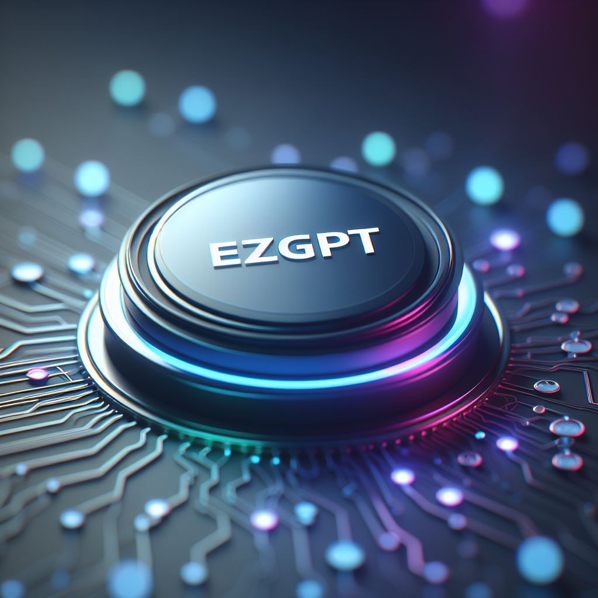

**Unlock the power of Generative AI with ResTech AI Corporation, the rapid AI innovation platform and pre-built industry solutions that helps you achieve remarkable results, privately and responsibly.**

At ResTech AI Corporation, we believe that Generative AI has the potential to revolutionize the way businesses operate. Our rapid innovation platform, ezGPT™ (**E**nterpri**z**e **G**enerative AI **P**latform for Digital **T**ransformation) with a layer of pre-built industry solutions make it easy for businesses and government agencies of all sizes to harness the power of Generative AI to achieve remarkable results.

Our mission is to make Generative AI accessible and useful for everyone, regardless of their technical expertise think "Easy Button". We believe that Generative AI has the potential to revolutionize many industries and government alike. It is poised to solve some of the world's most pressing problems.

We are committed to building AI that is private, responsible, and trustworthy. We use a variety of techniques to protect user data and privacy, and we work closely with our customers to ensure that our AI models are used ethically and responsibly. We subscribes to the tenants of [Safe, Secure and Trustworthy AI](https://www.whitehouse.gov/wp-content/uploads/2023/07/Ensuring-Safe-Secure-and-Trustworthy-AI.pdf). Our platform is designed to help you achieve remarkable results with Generative AI, while protecting your data privacy and security. We use the latest privacy-preserving techniques to ensure that your data is always safe and sound.

Our platform is designed to be easy to use and powerful, so that anyone can benefit from Generative AI models, even if they don't have a background in machine learning. It is designed to be flexible and scalable, so you can deploy it as a SaaS, PaaS, or on-premise solution. We also offer a variety of pre-built industry solutions that are ready to deploy, so you can start using Generative AI to improve your business processes immediately.

ResTech AI Corporation provides a powerful suite of tools and services that make it easy to develop, deploy, and manage Generative AI solutions at scale. 

Whether you're looking to automate tasks, generate new insights, or create innovative products and services, we can help you achieve your goals. With our platform and solutions, you can:

* **Build custom Generative AI models** tailored to your specific needs, without any coding required.
* **Deploy your models to any environment**, including SaaS, PaaS, and On-Prem.
* **Access pre-built, ready-to-deploy Generative AI solutions** for a variety of industries:
    * * Government
    * * Cyber Security
    * * Healthcare
    * * Small Business

**See the future of AI with ResTech AI Corporation.**

**Trusted AI Assistant**

Our Trusted AI Assistant helps you automate tasks, make decisions, and solve problems more efficiently and effectively. It can be used for a variety of tasks, such as:

* Customer service
* Sales and marketing
* Product development
* Risk management
* Research and development
* Document Translation

**AI Planner**

Our AI Planner helps you automate your planning and scheduling processes. It can be used for a variety of tasks, such as:

* Supply chain management
* Project management
* Workforce scheduling
* Resource allocation
* Travel planning

**Expert Knowledge Agent**

Our Expert Knowledge Agent helps you capture and share your expertise in a structured and accessible format. It can be used for a variety of tasks, such as:

* Knowledge management
* Training and development
* Customer support
* Sales and marketing
* Decision support
* Coding Assistant

**Collaborative Autonomous Team**

Our Collaborative Autonomous Team helps you create teams of AI agents that can work together to achieve complex goals. It can be used for a variety of tasks, such as:

In the realm of artificial intelligence, our Collaborative Autonomous Team stands as a pioneering solution, harnessing the power of synergy among AI agents to accomplish intricate objectives. This cutting-edge technology transcends traditional boundaries, enabling the seamless collaboration of intelligent entities towards a common goal. By fostering a harmonious interplay of algorithms, our platform empowers businesses to navigate complex tasks with unprecedented efficiency and precision.

Whether it's optimizing resource allocation, streamlining workflow processes, or tackling multifaceted challenges, our Collaborative Autonomous Team is designed to adapt and evolve in response to dynamic environments. Drawing inspiration from the principles of collective intelligence, this innovative approach not only enhances task performance but also unlocks new frontiers in AI capabilities. As businesses navigate the complexities of the modern landscape, our Collaborative Autonomous Team emerges as a beacon of transformative potential, paving the way for unprecedented advancements in artificial intelligence collaboration.

* Manufacturing
* Logistics
* Customer service
* Sales and marketing
* Research and development

**Contact us today to learn more about how ResTech AI Corporation can help you unlock the power of Generative AI.**
